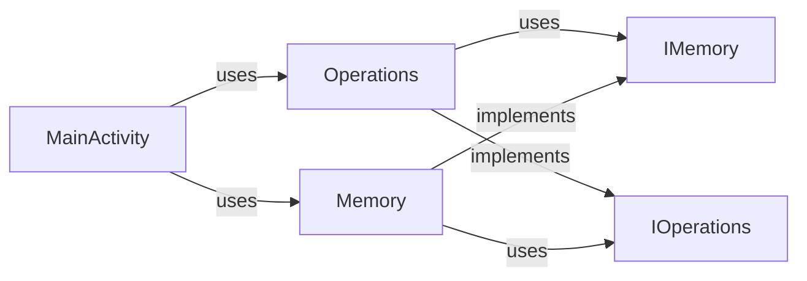
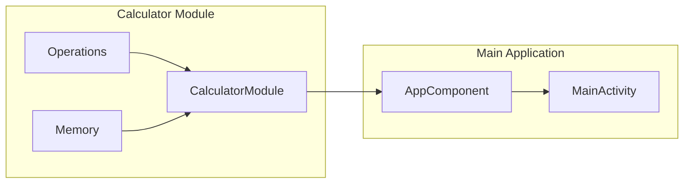

# CalculatorIoC

A simple android application in Java programming language that faces the circular dependency issue. The application contains a Calculator Module that implements the primitive operations and manages the memory.

Calculator Module keeps two classes, the `Operations.java` implements the arithmetics operations (actually only add), and `Memory.java` saves the value requested and implemented the M+ operation (M+ = add a value to the current saved value in memory).

`Operations.java` and `Memory.java` are linked by a circular dependecy. This issue has been resolved in two approach: via _Dagger2_ and via _Dependecy Inverse Principle_.

This app has not the UI (shows a hello world text). The entry point is the `MainActivity` class and the result is shown in log cat as below.

```
2019-09-08 13:11:43.471 4535-4535/morg.ros.calculatorioc I/Operations_Dagger: 3
2019-09-08 13:11:43.471 4535-4535/morg.ros.calculatorioc I/Operations_Dagger: 8
2019-09-08 13:11:43.471 4535-4535/morg.ros.calculatorioc I/Operations_DIP: 3
2019-09-08 13:11:43.471 4535-4535/morg.ros.calculatorioc I/Operations_DIP: 8
```
### DPI

### Dagger2

